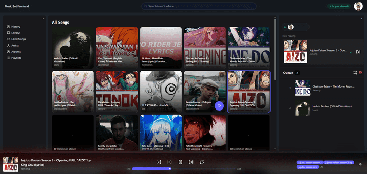

[](https://codecov.io/gh/9921622/DiscordYTStreamBot)
[](https://codecov.io/gh/9921622/DiscordYTStreamBot)

# DiscordYTStreamBot



A self-hosted Discord music bot with a web frontend. Users authenticate via Discord OAuth, and the bot streams YouTube audio in voice channels. The stack is fully containerised and served behind Nginx.

---

## Architecture

```
Browser
  └── Nginx (:80)
        ├── /          → React Frontend (:5173 dev / :3000 prod)
        ├── /dj/       → DJ Backend — Django + DRF (:8000)
        ├── /bot/      → Discord Bot — FastAPI + Uvicorn (:8080)
        └── /ws/       → Discord Bot WebSocket (:8080)
```

### Services

| Service | Stack | Port |
|---|---|---|
| `react-frontend` | React Router, Vite, TailwindCSS, DaisyUI | 5173 (dev) / 3000 (prod) |
| `dj-backend` | Django 5, Django REST Framework, SimpleJWT | 8000 |
| `discordbot` | FastAPI, Uvicorn, discord.py, FFmpeg | 8080 |
| `nginx` | Nginx Alpine | 80 |

---

## Project Structure

```
DiscordYTStreamBot/
├── apps/
│   ├── discordbot/         # FastAPI + discord.py bot
│   ├── dj-backend/         # Django REST API
│   ├── react-frontend/     # React Router frontend
│   └── nginx/
│       ├── nginx.dev.conf
│       └── nginx.prod.conf
├── docker-compose.yml      # Production base
├── docker-compose.dev.yml  # Dev overrides (hot-reload)
├── run_tests.sh
└── run_tests.bat
```

---

## Prerequisites

- [Docker](https://docs.docker.com/get-docker/) and Docker Compose
- A [Discord application](https://discord.com/developers/applications) with:
  - OAuth2 redirect URI registered
  - Privileged Gateway Intents enabled (Server Members, Message Content, Presence)

---

## Environment Variables

Each service has its own `.env` file. Copy the examples to get started:

```bash
cp apps/discordbot/.env.example apps/discordbot/.env
cp apps/dj-backend/.env.example apps/dj-backend/.env
cp apps/react-frontend/.env.development.example apps/react-frontend/.env.development
```

### `apps/discordbot/.env`

```dotenv
DISCORD_TOKEN=

INTERNAL_API_KEY=

FRONTEND_URL=http://10.0.0.3        # Your server IP, served by Nginx

APP_HOST=0.0.0.0
APP_PORT=8080

BACKEND_HOST=http://dj-backend:8000
CORS_HOSTS=["http://10.0.0.3"]

DEBUG=True
```

### `apps/dj-backend/.env`

```dotenv
SECRET_KEY=

DEBUG=True
BACKEND_URL=http://10.0.0.3/dj
FRONTEND_URL=http://10.0.0.3

ALLOWED_HOSTS=["127.0.0.1","localhost","10.0.0.3","dj-backend","nginx"]
CORS_ALLOWED_ORIGINS=["http://10.0.0.3"]

DISCORD_CLIENT_SECRET=
DISCORD_CLIENT_ID=

INTERNAL_API_KEY=
```

### `apps/react-frontend/.env.development`

```dotenv
VITE_APP_NAME="Music Bot Frontend"

VITE_API_URL=/dj
VITE_DISCORD_BOT_URL=/bot
VITE_DISCORD_BOT_WS=/ws

DJ_BACKEND_URL=http://localhost:8000
DISCORD_BOT_URL=http://localhost:8080
DISCORD_BOT_WS=ws://localhost:8080
```

---

## Running

### Development (hot-reload)

```bash
docker compose -f docker-compose.yml -f docker-compose.dev.yml up --build
```

Access the app at `http://<your-server-ip>` or `http://localhost` if running locally.

### Production

```bash
docker compose up --build
```

### Useful Commands

```bash
# Run in background
docker compose up --build -d

# Tail logs for a specific service
docker compose logs -f discordbot

# Rebuild a single service
docker compose up --build dj-backend

# Tear everything down
docker compose down
```

For dev, prefix all commands with `-f docker-compose.yml -f docker-compose.dev.yml`.

---

## Discord OAuth Setup

1. Go to [discord.com/developers/applications](https://discord.com/developers/applications)
2. Select your app → **OAuth2** → **Redirects**
3. Add your redirect URI — this must exactly match `BACKEND_URL` + `/api/discord/login`:
   ```
   http://10.0.0.3/dj/api/discord/login
   ```
4. Under **Bot** → **Privileged Gateway Intents**, enable:
   - Server Members Intent
   - Message Content Intent
   - Presence Intent

---

## Running Tests

```bash
# Locally
./run_tests.sh        # Linux/Mac
run_tests.bat         # Windows

# Inside Docker
docker compose -f docker-compose.yml -f docker-compose.dev.yml exec discordbot python -m pytest tests/ -v
docker compose -f docker-compose.yml -f docker-compose.dev.yml exec dj-backend python -m pytest tests/ -v
```

Tests also run automatically on GitHub Actions on every push and pull request to `main` and `production`.

---

## Django Management

```bash
# Run migrations
docker compose exec dj-backend python src/manage.py migrate

# Create superuser
docker compose exec dj-backend python src/manage.py createsuperuser

# Django shell
docker compose exec dj-backend python src/manage.py shell
```

---

## Notes

- Nginx handles all routing — only port 80 needs to be exposed externally
- Container-to-container communication uses Docker service names (e.g. `dj-backend:8000`)
- The Vite dev proxy is only active when running outside Docker (`DOCKER` env var is not set)
- Django migrations run automatically on container start
